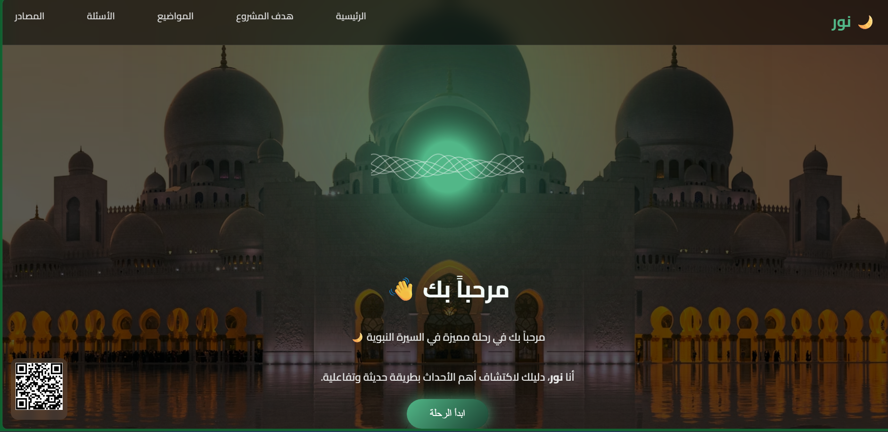

  

>
# 🌙 مشروع "نور" - السيرة النبوية

مشروع تعليمي تفاعلي يهدف إلى تقديم أحداث السيرة النبوية بطريقة مبسطة وحديثة باستخدام واجهة جذابة وتجربة مستخدم سهلة.

---

## 💡 فكرة المشروع

يعتمد المشروع على وجود مرشدة رقمية باسم **"نور"**، تقوم بإرشاد المستخدم داخل الموقع وتساعده على استكشاف أحداث السيرة النبوية بطريقة ممتعة وتفاعلية.

---

## 🎯 الهدف من المشروع

- تبسيط أحداث السيرة النبوية
- تقديم محتوى تعليمي تفاعلي
- مساعدة المستخدم على التعلم بطريقة حديثة
- ربط المعلومات بأسئلة تفاعلية (Quiz)

---

## 📚 محتوى الموقع

يشمل الموقع عدة مواضيع رئيسية:

- 📜 صحيفة المدينة  
- ⚔️ غزوة بدر  
- 🛡️ غزوة أحد  
- 🏹 غزوة الخندق  
- 🏰 غزوة خيبر  

كل موضوع يحتوي على:
- شرح مبسط
- أهم الأحداث
- النتائج
- الدروس المستفادة

---

## 🧠 صفحة الأسئلة (Quiz)

- اختبار تفاعلي لكل موضوع  
- أسئلة اختيار من متعدد  
- عرض الإجابة الصحيحة مباشرة  
- تقييم المستخدم في نهاية الاختبار  

---

## 🎨 مميزات المشروع

- تصميم عصري وجذاب  
- دعم اللغة العربية (RTL)  
- شخصية تفاعلية "نور"  
- QR Code للوصول السريع للموقع  
- تجربة مستخدم سهلة وبسيطة  

---

## 🌐 رابط الموقع

👉 https://elgharibahmed091.github.io/noor-project/

---

## 🛠️ التقنيات المستخدمة

- HTML  
- CSS  
- JavaScript  

---

## 📌 ملاحظات

تم تصميم المشروع كجزء من عمل تعليمي لعرض مهارات تطوير واجهات المستخدم وبناء مواقع تفاعلية.

---

## 👨‍💻 المطور

نور

---
